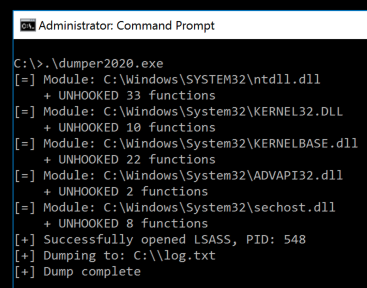

## dumper2020

### Summary

Yet another proof-of-concept for an LSASS memory dumper. This one incorporates established techniques and attempts to neutralize all user-land API hooks before dumping LSASS.

### Credit/Thanks

Dumper2020 relies almost completely on the work of others, to whom I owe a great deal of thanks:

* **[@Jackson_T](https://twitter.com/Jackson_T)** - Syscall macros were generated with [SysWhispers](https://github.com/jthuraisamy/SysWhispers) and code from [TelemetrySourcerer](https://github.com/jthuraisamy/TelemetrySourcerer) was adapted for API hook detection/removal.
* **[@monoxgas](https://twitter.com/monoxgas)** - [sRDI](https://github.com/monoxgas/sRDI) was integrated to dynamically load the system DLL that exports the *MiniDumpWriteDump* function.
* **[@SpecialHoang](https://twitter.com/SpecialHoang)** - No LSASS dumping/EDR avoiding tool is complete without crediting this [2019 Medium post](https://medium.com/@fsx30/bypass-edrs-memory-protection-introduction-to-hooking-2efb21acffd6) and the associated proof-of-concept, [AndrewSpecial](https://github.com/hoangprod/AndrewSpecial), which uses Win32 API functions to unhook *NtReadVirtualMemory* before dumping LSASS.
* **[@Cneelis](https://twitter.com/Cneelis)** - Building on @SpecialHoang's work, [Dumpert](https://github.com/outflanknl/Dumpert) uses syscalls to unhook *NtReadVirtualMemory* before dumping LSASS. The [associated write-up](https://outflank.nl/blog/2019/06/19/red-team-tactics-combining-direct-system-calls-and-srdi-to-bypass-av-edr/) is a fixture in the modern red team blog corpus.
* **[@b4rtik](https://twitter.com/b4rtik)**/**[@matteomalvica](https://twitter.com/matteomalvica)** - Incorporated the Defender ATP *PssCaptureSnapshot* bypass detailed in this [blog post](https://www.matteomalvica.com/blog/2019/12/02/win-defender-atp-cred-bypass/) and the associated proof-of-concept, [ATPMiniDump](https://github.com/b4rtik/ATPMiniDump).

### Background

As demonstrated by AndrewSpecial and Dumpert, unhooking *NtReadVirtualMemory* is typically enough to avoid EDR preventative measures when dumping LSASS. However, if *MiniDumpWriteDump* is hooked, dumping LSASS will still generate alerts. Dumper2020 builds on the Dumpert idea and uses syscalls for most tasks where possible but takes things up a notch by attempting to remove all user-land API hooks before calling *MiniDumpWriteDump*. If successful, this should further reduce the chance of preventative action and decrease the overall indicator footprint. User-land API hooks are only one source of telemetry, though. EDR sensors will still record the following events, at least, thanks to kernel callbacks and mini-filters:

* LSASS handle creation
* Dump file creation

### Usage

The dumper2020 solution consists of three projects:

* **dumper2020** builds a static library that provides the core functionality.

* **dumper2020_dll** builds a DLL that links the static library and attempts to dump LSASS to `C:\Windows\Temp\setup_error_log.txt` when executed.

* **dumper2020_exe** builds an EXE that links the static library and attempts to dump LSASS to `log.txt` in the current directory when executed.

Syscall macros are not provided, but can be quickly generated with [SysWhispers](https://github.com/jthuraisamy/SysWhispers). Please refer to that project's [README](https://github.com/jthuraisamy/SysWhispers/blob/master/README.md) for integration guidance. Alternative syscall implementations could be leveraged with minimal effort.

For reference, dumper2020 uses the following syscalls:

```
NtAdjustPrivilegesToken
NtClose
NtCreateFile
NtDeleteFile
NtOpenProcess
NtOpenProcessToken
NtProtectVirtualMemory
NtQueryInformationToken
NtQuerySystemInformation
NtWriteVirtualMemory
```

### Screenshot



### Considerations

* 64-bit only
* Visual Studio 2019 (v142)
* Lightly tested on Windows 2012 R2 and Windows 10 with some common EDR solutions
* As a proof-of-concept, this solution should not be considered operationally secure as is